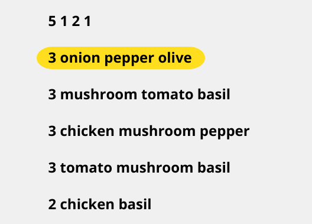
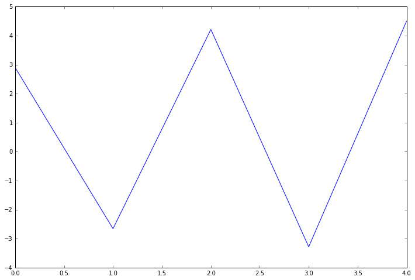
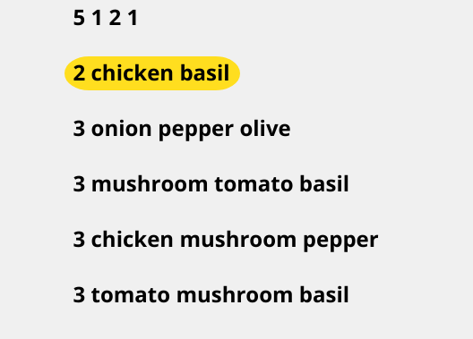
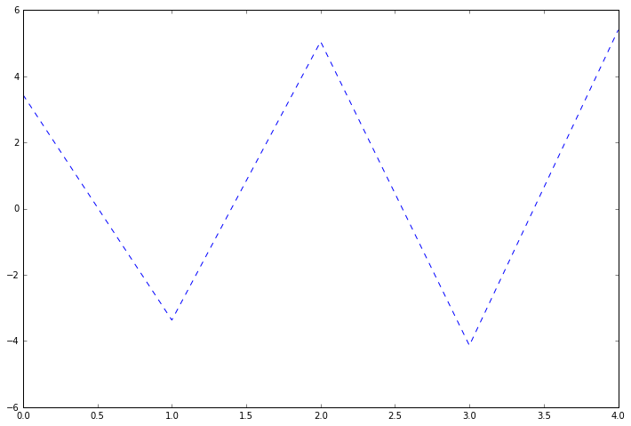
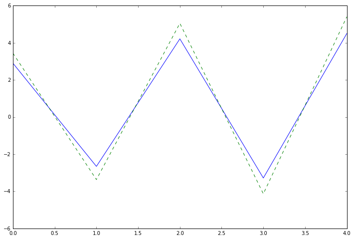
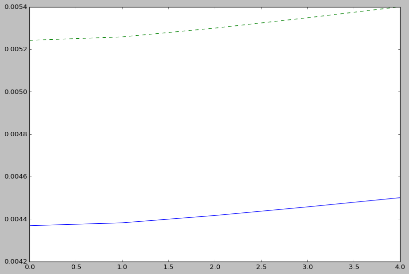

# Pizza-

# Monte Carlo Tree Search (MCTS)

## Problem A

```python

"""a_example

5 1 2 1 
2 chicken basil
3 onion pepper olive
3 mushroom tomato basil
3 chicken mushroom pepper
3 tomato mushroom basil

"""

python state_space.py --file a_example

output:
('4-0-1-2-Remaining', [0.005241708328031525, 0.005257848531642693, 0.005299289285364182, 0.005347979662831151, 0.005399999999999997])

```

Solution Description
--------------------

- In the output tuple 1 entry, `4-0-1-2-Remaining` determines the order, 

- The `Remaining` relates to the other element that is not found in the `range(0,5)`, i.e. 3

- The Values are incremental values based on a reward framework

- The Values are incremental values based on a reward framework with more magnitude.

Alternative Configuration of the File
-------------------------------------

```python

"""a_example

5 1 2 1 
3 onion pepper olive
3 mushroom tomato basil
3 chicken mushroom pepper
3 tomato mushroom basil
2 chicken basil

"""

python state_space.py --file a_example

output:
('0-1-2-1-Remaining', [0.004368090273359603, 0.00438154044303558, 0.00441607440447015, 0.0044566497190259595, 0.004500000000000003])

```

Solution Description
--------------------

- In the output tuple 1 entry, `0-1-2-1-Remaining` determines the order, 

- The `Remaining` relates to the other element that is not found in the `range(0,5)`, i.e. 3 or 4, we know 3 and 1 are equivalent, hence Remaining = 4

- The Values are incremental values based on a reward framework with less magnitude and less noise.

## Plots

**There are two solutions that exist**

Reward Framework is built on:

```python

    (len(j) + sum(ing[ii]) + int(len(intersection(i, j)) == len(i)))*1e-3 * 0.9

    """where:

    j: refers to the Pizza, one of the elements from:
    pizza_requirements = {
        'pizza_0': ['onion', 'pepper', 'olive'],
        'pizza_1': ['mushroom', 'tomato', 'basil'],
        'pizza_2': ['chicken', 'mushroom', 'pepper'],
        'pizza_3': ['tomato', 'mushroom', 'basil'],
        'pizza_4': ['chicken', 'basil'],
    }

    ing: refers to core ingredients vs side ingredients
    ing[ii]: is one of the elements from
    ingredients = {
        'pizza_0': [0,0,0],
        'pizza_1': [1,1,0],
        'pizza_2': [1,1,0],
        'pizza_3': [1,1,0],
        'pizza_4': [1,0],
    }

    i: refers to the problem, for example:
    3 onion pepper olive

    1e-3: scaling factor for reducing it to less that one

    0.9: scaling factor for reward

```

**1 percentage of the rewards are always reduced at every iteration**

```python

def _backpropagate(self, path, reward):
    for node in reversed(path):
        self.N[node] += 1
        self.Q[node] += reward
        reward /= 1.01  # 1% of the rewards are always reduced, discounted returns

```

## Plots 1

```python

"""a_example

5 1 2 1 
3 onion pepper olive
3 mushroom tomato basil
3 chicken mushroom pepper
3 tomato mushroom basil
2 chicken basil

"""

```





```python

"""a_example

5 1 2 1 
2 chicken basil
3 onion pepper olive
3 mushroom tomato basil
3 chicken mushroom pepper
3 tomato mushroom basil

"""

```





## Comparison

**Based on a different Reward Framework:**



**Separation of Values based on current Rewards Framework:**



**Goal**

- **Dissatisfaction**: _Eliminate Fuzzy_
- **Satisfaction**: _Promote Cluster_

- **Pass Through**: Consider all
- **Split Process**: Consider Split only

**Metrics Table**

- n x 4 matrix results

|   | Dissatisfaction | Satisfaction | Pass-Through | Split |
|---|-----------------|--------------|--------------|-------|
|   |                 |              |              |       |
|   |                 |              |              |       |
|   |                 |              |              |       |

**Grouping**

- Grouping is based on the best pizza goes for the largest number of teams
- The best pizza depends on UCT value of the split at the top most element, the best pizza also depends on n x 4 matrix results. 

